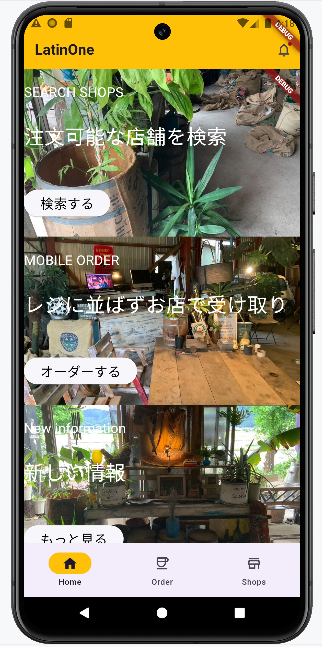
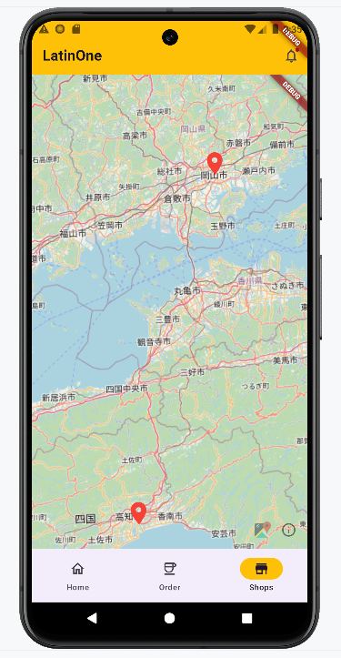
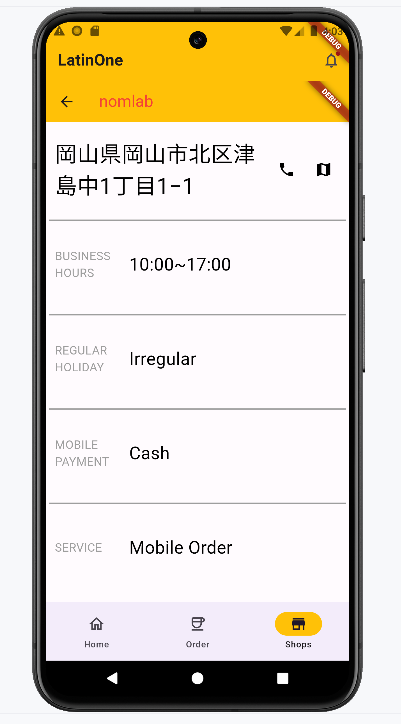

# LatinOne
LatinOne は，乃村研究室で開発している，コーヒー豆注文用スマホアプリである．

以下の画像は，LatinOne のホーム画面である．  


LatinOne では，以下の機能が利用できる．  
1. 商品の注文  
2. 店舗の検索  
3. 店舗からのお知らせ受取  

### 1\. 商品の注文
以下の画像は，LatinOne の商品注文画面である．  
アプリ下側にある「Order」タブを押下すると，商品注文画面に遷移する．


商品を注文するには，以下3つの項目を入力する必要がある．  
1. 注文を依頼する店舗  
2. 配送先情報
    * 氏名
    * ニックネーム
    * メールアドレス
    * 郵便番号
    * 住所  
3. 注文商品  

各項目を埋めると，以下のような画面になり，入力した各情報が表示される．また，購入ボタンが押下可能になる．  

  
購入ボタンを押すと，商品の購入が完了する．

### 2\. 店舗の検索
以下の画像は，LatinOne の店舗検索画面である．  
アプリ下側にある「Shops」タブを押下すると，店舗検索画面に遷移する．  
  
店舗検索画面では，上記のように各店舗の箇所にピンが立つ．  
また，ピンを押下すると，以下のようにその店舗の情報が表示される．  
  

### 3\. 店舗からのお知らせ受取
以下の画像は，LatinOne のお知らせ受取画面である．  
アプリ右上にあるベルのアイコンを押下すると，お知らせ受取画面に遷移する．  
  
お知らせ受取画面では，新商品や新店舗などのお知らせを確認できる．

# Requirements
* flutter 3.19.5
* AndroidStudio Jellyfish


# Install and Setup
- clone
  - 以下のコマンドを実行し，このリポジトリを clone する．

    ```
    $ git clone https://github.com/ueno12345/latin_one.git
    ```
- run
  - AndroidStudio 上で動作させることを想定している．
  1. パッケージの読み込み  
      - 以下のコマンドを実行し，アプリの動作に必要なパッケージを読み込む．

        ```
        $ flutter pub get
        ```
  2. アプリの実行  
      - 以下のコマンドを実行し，アプリを実行する．

        ```
        $ flutter run
        ```

- .env の説明
